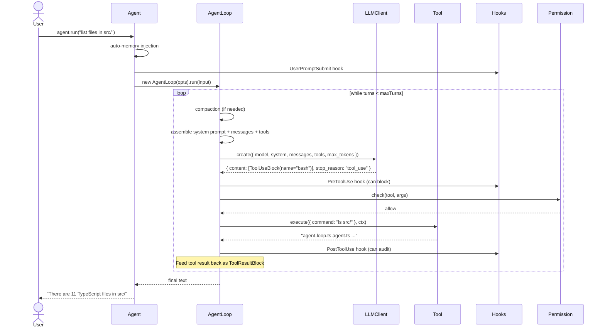

# MochiKit Architecture

> **A beginner-friendly guide to how MochiKit works under the hood.**

MochiKit is an AI Agent framework. If you've used ChatGPT, you know the basic idea: you send a message, the model replies. An **agent** takes this further — the model can call **tools** (like running bash commands or searching the web), see the results, and decide what to do next. It loops until it has a final answer.

This document explains how MochiKit orchestrates that loop, and why it's designed the way it is.

---

## 1. The Big Picture

```mermaid
flowchart TB
    subgraph User["👤 User Code"]
        direction LR
        create["new Agent({...})"]
        run["agent.run(input)"]
        output["final text response"]
    end

    subgraph Agent["🤖 Agent"]
        direction TB
        hooks_in["UserPromptSubmit hooks"]
        memory["auto-memory injection"]
    end

    subgraph Loop["🔄 AgentLoop"]
        direction TB
        compact["compact context"]
        assemble["assemble LLM params"]
        call["call LLM"]
        check{"stop_reason?"}
        tools["dispatch tools"]
        results["feed results back"]
    end

    subgraph Harness["⚙️ Harness"]
        direction LR
        recovery["Recovery\n(retry/backoff)"]
        permission["Permission\n(deny→rule→ask)"]
        hooks_out["Hooks\n(Pre/PostToolUse)"]
        compaction["Compaction\n(budget→micro→snip)"]
    end

    User --> Agent
    Agent --> Loop
    call --> Harness
    compact --> Harness
    tools --> Harness
    Loop --> User
```

**The core insight**: every agent runs the same loop — `compact → LLM call → tool dispatch → repeat`. All the complexity (hooks, permissions, recovery, compaction) hangs off this loop as pluggable harness components.

---

## 2. The Agent Loop — Step by Step

This is the heart of MochiKit. Here's what happens when you call `agent.run("list files in src/")`:

```
while (turns < maxTurns):         ← safety limit (default: 30)
  │
  ├─ 1. Compact context          ← shrink if conversation gets too long
  │     ├─ ToolResultBudget      ← truncate huge tool outputs to N characters
  │     ├─ MicroCompaction       ← summarize old tool results in-place
  │     └─ SnipCompaction        ← drop oldest messages (last resort)
  │
  ├─ 2. Assemble LLM params      ← build the request: model, system prompt, messages, tools
  │
  ├─ 3. Call LLM (with retry)    ← Recovery handles errors transparently
  │     ├─ 429/529 → exponential backoff + jitter
  │     ├─ prompt_too_long → one-shot reactive compaction
  │     └─ sustained overload → switch to fallbackModel
  │
  ├─ 4. Check stop_reason
  │     ├─ end_turn → return final text ✅
  │     └─ tool_use → dispatch each tool
  │           ├─ PreToolUse hooks (can block)
  │           ├─ Permission check (deny → rule → ask)
  │           ├─ Execute tool
  │           └─ PostToolUse hooks (can audit)
  │
  └─ 5. Feed results back to LLM → repeat from step 1
```

### Why a loop?

Because one LLM call isn't enough for real work. The model might need to:
1. Call `bash` to list files → see the output → call `read` to open a file → see the content → answer

Each "call → result → call" is one turn. `maxTurns=30` prevents infinite loops.

### Why 0-API-call compaction?

Most frameworks call a smaller/cheaper LLM to summarize context. MochiKit uses deterministic strategies instead:
- **Budget**: just truncate long outputs (cost: 0 tokens)
- **Micro**: replace old tool results with a brief summary marker (cost: 0 tokens)
- **Snip**: drop the oldest messages, keep the most recent (cost: 0 tokens)

This means compaction never adds latency or cost — it's pure string manipulation.

---

## 3. Dependency Injection — Everything is Constructor-Injected

MochiKit has **zero global singletons** (except the read-only config cache). Every component is passed in through the constructor:

```ts
const agent = new Agent({
  llm:        new AnthropicAdapter({ apiKey, baseURL }),  // ← you choose the LLM
  model:      'glm-4.7',                                   // ← you choose the model
  tools:      [createBashTool(), ...createFsTools()],       // ← you choose the tools
  memory:     new MarkdownMemory({ dir: './.mochikit' }),   // ← you choose the storage
  permission: new PermissionManager({ resolver }),          // ← you choose the security
  hooks:      new HookManager(),                            // ← you choose the lifecycle
  // ...everything is swappable
});
```

### Why this matters

1. **Testability**: In tests, inject a `MockLLMClient` that returns scripted responses — no network, no API key, instant results.
2. **Flexibility**: Swap any component without touching the loop. Want a different LLM provider? Write an adapter implementing `LLMClient`. Want Postgres memory? Implement `Memory`.
3. **No hidden state**: Every dependency is visible in the constructor. You always know what an agent depends on.

---

## 4. Component Map

| Module | File | Role | Key Interface |
|---|---|---|---|
| **AgentLoop** | `core/agent-loop.ts` | The inference loop: compact → LLM → dispatch → repeat | `AgentLoopOptions` |
| **Agent** | `core/agent.ts` | User-facing class; composes all components; implements `PluginHost` | `AgentOptions` |
| **LLMClient** | `core/llm-client.ts` | Provider-agnostic LLM adapter (1 method: `create`) | `LLMClient` |
| **Recovery** | `core/recovery.ts` | Error handling: 429/529 backoff, prompt_too_long compaction, fallback model | `RecoveryOptions` |
| **Compaction** | `core/compaction.ts` | 3-layer 0-API-call context shrinking | `CompactionLayer` |
| **Permission** | `core/permission.ts` | 3-gate pipeline: deny → rule → ask → resolver | `PermissionRule`, `PermissionResolver` |
| **Hooks** | `core/hooks.ts` | 4 lifecycle events: UserPromptSubmit, PreToolUse, PostToolUse, Stop | `HookEvent`, `HookManager` |
| **Tool** | `core/tool.ts` | Tool contract + BaseTool convenience class | `Tool`, `ToolContext` |
| **ToolRegistry** | `core/tool-registry.ts` | Dispatch map with namespaced registration | `ToolRegistry` |
| **Context** | `core/context.ts` | Mutable conversation history (system prompt + messages) | `ConversationContext` |
| **Types** | `core/types.ts` | Content block discriminated union (mirrors Anthropic Messages API) | `ContentBlock`, `Message` |
| **SystemPrompt** | `core/system-prompt.ts` | Dynamic prompt assembly from `PromptSection[]` | `PromptSection` |
| **Config** | `infra/config.ts` | Multi-provider .env loading with auto-discovery | `MochiConfig`, `ProviderConfig` |
| **Memory** | `memory/memory.ts` | CRUD + semantic query contract | `Memory`, `MemoryEntry` |
| **MarkdownMemory** | `memory/markdown-memory.ts` | Filesystem-backed memory (YAML frontmatter + MEMORY.md index) | — |
| **VectorStore** | `memory/vector-store.ts` | Embedding-based semantic search contract | `VectorStore` |
| **MessageBus** | `infra/message-bus.ts` | Consumable mailbox (FIFO, destructive read) for team communication | `MessageBus`, `BusMessage` |
| **TaskStore** | `infra/task-store.ts` | DAG task model with `blockedBy` dependencies | `TaskStore`, `Task` |
| **SkillRegistry** | `infra/skill-registry.ts` | Two-level SKILL.md loading (catalog + on-demand) | `SkillRegistry` |
| **BackgroundTasks** | `infra/background-tasks.ts` | Non-blocking bash execution with polling | `BackgroundTaskManager` |
| **Plugin** | `plugins/plugin.ts` | Fluent builder: `.tool().hook().rule().build()` | `Plugin`, `PluginHost` |
| **ManagerWorker** | `collaboration/manager-worker.ts` | Manager delegates to workers via `spawn_teammate` | `WorkerSpec` |
| **SequentialChain** | `collaboration/chain.ts` | Linear pipeline: each agent's output → next agent's input | — |
| **Team** | `collaboration/team.ts` | Peer-to-peer messaging via shared MessageBus | `TeamOptions` |
| **Protocols** | `collaboration/protocols.ts` | State machine for structured team communication | `ProtocolManager` |

---

## 5. Data Flow — A User Message Through the System



### Key observations

1. **Every tool call goes through 3 gates**: PreToolUse hooks → Permission check → PostToolUse hooks. The model never gets to execute tools directly.
2. **Tool results become part of the conversation**: they're appended as `ToolResultBlock` messages, so the LLM can "see" them on the next turn.
3. **The loop is stateless between iterations**: it just reads the current `ConversationContext` (which has grown by one user/assistant/tool exchange per turn).

---

## 6. Design Decisions — Why Things Are the Way They Are

### 6.1 Anthropic-compatible protocol (not vendor-specific)

MochiKit uses the Anthropic Messages API format internally (`TextBlock`, `ToolUseBlock`, `ToolResultBlock`). But it's not locked to Anthropic — any provider with an Anthropic-compatible endpoint works (GLM, DeepSeek, OpenRouter, etc.). The `AnthropicAdapter` just translates MochiKit types ↔ Anthropic SDK types.

**Why**: Anthropic's content-block model is the most structured and widely-adopted format for tool-use. It cleanly represents multi-modal tool interactions. Most Chinese LLM providers now offer Anthropic-compatible endpoints.

### 6.2 Tool namespacing (MCP-style)

Tools are registered with namespaced names like `mcp__filesystem__read_file`. This prevents collisions when multiple plugins define tools with the same name.

**Why**: As the plugin ecosystem grows, name collisions become inevitable. Namespacing follows the MCP (Model Context Protocol) convention, making MochiKit tools compatible with MCP-based tools and vice versa.

### 6.3 Context compaction layers

The 3-layer compaction pipeline runs **before** the LLM call, not after:

1. **ToolResultBudget** (cheapest) — applied first
2. **MicroCompaction** (middle) — only if budget wasn't enough
3. **SnipCompaction** (last resort) — drops messages only when necessary

**Why**: Layering means we try the cheapest fix first. Only escalate to more aggressive compaction when cheaper layers aren't sufficient. This mirrors how OS memory management works (page cache → swap → OOM killer).

### 6.4 Recovery strategy

| Error | Response | Why |
|---|---|---|
| 429 / 529 (overload) | Exponential backoff + jitter, then fallback model | Retries give the provider time to recover; jitter prevents thundering herd |
| `prompt_too_long` | One-shot reactive compaction | The conversation grew too large during the loop; compact once and retry |
| `max_tokens` truncation | 4× token escalation, then continuation prompts | The model had more to say; give it room, then ask it to continue |

**Why**: Recovery is transparent to the user. The agent keeps trying different strategies until something works or all options are exhausted.

### 6.5 Plugin system — bundling, not a framework

Plugins bundle tools + hooks + permission rules into a reusable package:

```ts
const plugin = new PluginBuilder('my-plugin')
  .tool(myTool)
  .hook('PreToolUse', myHook)
  .rule(myRule)
  .build();

agent.use(plugin);
```

**Why**: Plugins are a **distribution mechanism**, not a runtime framework. They don't introduce a plugin lifecycle, dependency graph, or sandbox. They simply batch-register components onto an agent. This keeps the core small and the mental model simple.

### 6.6 Permission defaults to Deny-All

If you create an `Agent` without specifying a `PermissionManager`, tools will be **denied** by default:

```ts
// Dangerous — tools will be blocked!
const agent = new Agent({ llm, model, systemPrompt, tools: [createBashTool()] });

// Safe — explicit allow
const agent = new Agent({
  llm, model, systemPrompt,
  tools: [createBashTool()],
  permission: new PermissionManager({ resolver: new AllowAllResolver() }),
});
```

**Why**: Fail-closed is the safe default. AI agents can execute arbitrary commands — you should explicitly opt in to allowing that.

---

## 7. Extension Points — Where You Can Plug In

MochiKit is designed to be extended at every layer:

| Extension Point | Interface | Example |
|---|---|---|
| **Custom LLM provider** | `LLMClient` | OpenAI adapter, local model adapter |
| **Custom tool** | `Tool` / `BaseTool` | Database query tool, API client tool |
| **Custom memory backend** | `Memory` | Postgres memory, Redis memory |
| **Custom vector store** | `VectorStore` | Chroma, Pinecone, Qdrant |
| **Custom permission resolver** | `PermissionResolver` | Interactive CLI prompt, policy engine |
| **Custom message bus** | `MessageBus` | Redis pub/sub, Kafka |
| **Custom task store** | `TaskStore` | Database-backed task DAG |
| **Plugin** | `Plugin` | Pre-built bundles of tools + hooks + rules |
| **Hook** | `HookCallback` | Audit logging, content filtering, cost tracking |

Each extension point is a single interface with 1-3 methods. You implement the interface and inject your implementation — no framework registration, no annotations, no config files.

---

## 8. Project Size — Small and Focused

| What | Count |
|---|---|
| Source files | 37 `.ts` files |
| Total source lines | ~3,900 (including comprehensive JSDoc) |
| Core loop engine | ~300 lines |
| Dependencies | 2 (`@anthropic-ai/sdk`, `dotenv`) |
| Public interfaces | ~15 (all 1-3 methods each) |

This is not an accident. MochiKit deliberately keeps the core small. The complexity is in the **harness components** (compaction, recovery, permission, hooks), each of which is a focused module you can understand in one reading.

---

## 9. Further Reading

- **[MochiKit 开发文档 (中文)](./zh/)** — 19-chapter developer guide covering every feature with runnable examples
- **[English Documentation](./en/)** — English translations of the developer guide
- **[Source Code](../src/)** — Every file has comprehensive JSDoc comments explaining why each design decision was made
- **[README](../README.md)** — Quick start, installation, and feature overview

---

<p align="center">
  <sub>Built with ❤️ for learners and builders of AI agents.</sub>
</p>
